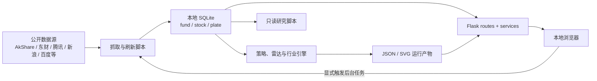

# 架构说明

本文描述 `financial-analysis` 当前的系统边界、主要数据流、持久化模型和必须保持的设计约束。用户入口与完整命令见 [README.md](README.md)，编码与验证规则见 [AGENTS.md](AGENTS.md)。

## 1. 系统定位

这是一个以本地缓存为中心的金融研究工作台，而不是在线交易系统。它由两部分组成：

- 离线数据面：抓取公开数据、写入 SQLite、计算策略/雷达/行业结果，并生成 JSON 或 SVG 产物。
- 本地控制面：Flask 读取已有产物、执行轻量重算，并在用户显式操作后启动后台脚本。

`run.py` 启动时只创建 Flask 应用并异步预热股票策略缓存，不会自动执行全量网络抓取。网页默认绑定 `127.0.0.1`，没有账号、鉴权或多租户边界。



## 2. 运行时分层

### 2.1 Web 层

`run.py` 调用 `app.create_app()`，注册五组 Blueprint：

| 路径 | 路由 | 服务/核心模块 | 职责 |
| --- | --- | --- | --- |
| `/` | `app/routes/home.py` | — | 工作台导航 |
| `/fund` | `app/routes/fund.py` | `app/services/fund_report_service.py` | 基金报告、基金配置编辑和刷新状态 |
| `/stock` | `app/routes/stock.py` | `app/services/stock_strategy_service.py` | 策略配置、轻量重打分、刷新、优化器与回测图 |
| `/radar` | `app/routes/radar.py` | `app/services/radar_service.py` | 雷达结果、实时行情、K 线、形态回放、三级行业热度报告和后台任务 |
| `/api/jobs/<id>` | `app/routes/jobs.py` | `app/services/job_service.py` | 通用后台任务状态和最近日志 |

路由层负责 HTTP 参数和响应；服务层负责文件/数据库读取、缓存和后台命令编排；大型策略与研究逻辑仍保留在顶层脚本中。前端是 Jinja 模板、原生 JavaScript 和 CSS，没有单独的打包步骤。

### 2.2 后台任务

`app/services/job_service.py` 在当前 Flask 进程中维护任务状态，并以独立进程组启动脚本、合并 stdout/stderr、限制日志长度、处理超时和终止子进程树。POSIX 系统使用进程组信号，Windows 使用新进程组和 `taskkill /T /F`；子进程统一启用 UTF-8 输出。

股票刷新、雷达刷新、雷达重算和优化器共享 `stock-data-refresh` 资源锁，避免同时改写同一 SQLite/JSON 产物。任务状态只存在内存中：Flask 重启后状态会丢失，但已经写入磁盘的产物保留。

`stock_radar_fresh_data.py` 是股票工作台与雷达共同使用的跨平台全量刷新入口，顺序为：

1. 校验并刷新 ETF 配置池行情。
2. 运行 `stock_data_refresh.py --mode full --no-proxy`，刷新股票、候选池、资本事件、短线信号和策略缓存；SW3 龙头流程同时原子生成三级行业 20 日热度报告。
3. 刷新申万二级行业历史。
4. 重建题材候选。
5. 以 `leader` 池重建默认雷达产物。

这个入口不接受候选池参数。切换雷达池只影响随后运行哪一种分析，不缩小全量底层刷新范围。Flask 使用 `sys.executable` 直接启动 Python 编排器，不经过 Shell；`stock_radar_fresh_data.sh` 仅是 Unix 手工调用的薄包装。

细分龙头行情子进程通过临时 JSON sidecar 把逐股失败交回编排器，父进程再写入 `data/stock_data_refresh_report.json`。首轮并发抓取与单线程写库全部结束后，抓取失败、空行情和写库失败的股票会按原池顺序逐只复试一次；首轮失败在复试成功后丢弃。报告顶层 `failures[]` 与对应步骤的 `meta.failure_details[]` 只保留最终失败的 `code`、`name`、`stage`、`error`，并带有复试数量、恢复数量和最终失败数量。子进程异常和空股票池仍作为无法归属到单股的全局失败。sidecar 使用独立临时目录和参数列表传递，兼容 Windows 路径与文件锁规则。

## 3. 核心数据流

### 3.1 基金链路

```text
funds.py
  -> fund_data_refresh.py
  -> Scrapy 基金概况 + fund_fetch_data.py
  -> data/fund_data.sqlite3
  -> fund_technical_analysis.py
  -> data/signals.json
  -> fund_generate_output.py
  -> data/fund_report_data.json
  -> Flask /fund
```

`funds.py` 是用户配置源。页面编辑器不会执行任意 Python，而是用 AST 只接受固定名称的六位基金代码列表和兼容样板，再原子写回 `funds.py` 与 `data/fund_codes.json`。基金刷新和配置保存共享资源锁，防止运行中改动抓取集合。`fund_data_refresh.py` 先重复执行同一套安全校验，再用当前 Python 的 `-m scrapy` 和参数列表依次启动各步骤；缓存清理使用 Python 标准库，因此不依赖 `stat`、`date`、`rm` 或 Bash。

### 3.2 A 股策略链路

```text
stock_data_refresh.py
  -> SW3 细分龙头行情/估值与基本面
  -> SW3 指数日频成交额 + AkShare/Sina 最新相邻交易日成分汇总 + 当前成员市值快照
  -> data/capital/sw3_industry_heat.json
  -> 基准 ETF NAV、指数成分、股东/回购等资本事件
  -> 游资小盘成员筛选
  -> 最终游资小盘成员估值与基本面补齐
  -> 龙虎榜/席位/技术快照
  -> data/stock_data.sqlite3
  -> stock_advanced_strategies.py --persist --rebuild-cache
  -> 策略结果 + 候选池缓存
  -> Flask /stock
```

`stock_advanced_strategies.py` 统一承载 `long`、`smallcap`、`short` 三套生产评分。Dashboard 修改权重或阈值时优先复用 `data/stock_strategy_candidate_cache.json`，避免每次重新扫描并构造候选池。

长线因子的数据刷新集合等于 `leader ∪ hotmoney`：龙头数据在前段刷新，游资小盘数据在本轮成员筛选完成后补齐。小盘补齐未全部成功时不切换 `is_hot_money` 标记，也不生成新的策略快照。策略诊断同时返回当前正权重口径的加权覆盖，以及财务/估值、价量、资金面等分项覆盖；缺失因子的默认分仍用于降级评分，但页面会明确暴露其覆盖缺口。

`stock_strategy_optimizer.py` 为三套策略分别搜索参数。长线与小盘使用 PIT walk-forward 框架；短线使用自己的短周期前推和代理目标。优化配置只写运行时 `data/`，缺失时才回退 `meta_data_backup/` 的版本化基线。

A 股日线统一经过 `stock_crawl_common.fetch_qfq_daily_records()`，按新浪、腾讯、东财的顺序故障转移；各适配器都输出前复权 OHLCV，成交量统一为“手”、成交额统一为“元”，涨跌幅按相邻前复权收盘校正。连续失败的数据源会在本轮暂时熔断，末尾复试失败股票前会重置熔断状态，使第二次刷新重新尝试完整公开源链路。ETF 先走基金专用东财接口，再回退通用源。

### 3.3 主力资金与 ETF 雷达链路

雷达有三类候选池：

| 池 | 成员来源 | 默认排序 |
| --- | --- | --- |
| `leader` | `sw3_member.is_leader=1` | 机会分 |
| `hotmoney` | `sw3_member.is_hot_money=1` | 反转分 |
| `etf` | `stock_etf_pool.py` 配置 + 最新校验报告 + `instrument_type=etf` + 已有历史 | 技术机会分 |

`stock_hot_money_radar.py` 从 `stock_history` 构造 PIT 日线窗口，匹配 P1–P26，计算吸筹、连续出货、机会、反转、阶段和解释字段，再写入 `data/capital/hot_money_ambush.json`。这个文件一次只代表最近运行的候选池，payload 中的 `pool` 是解释结果时必须检查的字段。

机会分在当前池内计算横截面百分位：

```text
机会分 = 吸筹百分位 ×（1 - 0.5 × 出货百分位 / 100）
```

阶段标签由形态优先级决定，不参与重复加分。`hotmoney` 池以反转分作为主排序；`leader` 和 `etf` 以机会分为主排序。

ETF 只复用行情和纯技术因子。`stock_crawl_etf_pool.py` 在刷新前用 ETF 主清单严格校验配置，然后借用股票历史刷新器写入前复权 OHLCV，但显式关闭估值、财报、质押、股东、回购和龙虎榜抓取。公司行为因子从 ETF 模型中移除，其余权重重新归一；这一口径仍属于待专项验证的技术启发式。

页面有两类不会直接改写离线产物的计算：

- 实时行情：批量取盘中报价，在内存中投影到前复权历史并重算当前形态；不写回 SQLite 或离线 JSON。
- 形态回放：`/api/radar/pattern-backtest` 只读完整日线，逐日按当时可见窗口回放生产买卖点，并返回图表标记；它不是参数优化器。

三级行业热度是独立离线报告：`sw3_industry_heat.py` 将所有有效 SW3 指数对齐到同一截止日和最近 20 个共同交易日，按成交额生成全部有效行业的热门排名，并把所有同时满足“末 5 日成交份额增长、20 日趋势相关性为正”的行业纳入升温排名。历史以申万指数日频数据为主；趋势接口停更的行业可由官方指数分析日表的成交额份额透明估算，行业与日度点都带 `amount_is_estimate`。份额接口暂时为空时只续用上一份已通过完整性校验的估算点，不续用旧 AkShare 派生点。

`sw3_akshare_latest.py` 只处理申万历史之后紧邻的一个已收盘交易日：无需 Token 地调用一次 AkShare `stock_zh_a_spot()`（新浪全 A 快照），按当前 SW3 membership 汇总成交额，并把来源标为成分汇总而非申万指数直接值。该路径必须同时通过行情锚点日期与收盘状态、交易日仅相差一天、全市场快照规模、成分匹配和行业覆盖门槛；结果以快照日期与 membership 指纹写入独立缓存。多日缺口、任一完整性门槛失败或最终统一截止日不一致时不写新旧混合结果，上一份原子报告继续保留。`GET /api/radar/industry-heat` 只读原子 JSON；页面按钮不会联网或重新计算。

`latent` 是独立的左侧观察模式：先复用 `ambush`，再按低位、低换手、低出货、未启动、吸筹、历史活跃基因和公司证据筛选，写入 `data/capital/hot_money_latent.json`。可选的 `stock_crawl_news.py` 会把新闻及粗粒度题材标签写入 `stock_news`；这些新闻只用于催化剂展示，不进入潜伏分。观察名单不是买点触发器。

### 3.4 行业周期链路

`plate_crawl_history.py` 把申万二级行业历史写入 `data/plate_data.sqlite3`。`industry_cycle_engine.py` 只依赖本地缓存即可计算价格位置、估值分位、成交活跃度、阶段与 20/60/120 日预测，并可写入 `data/industry_cycle/*.json`。同一板块库也为雷达题材热度和形态上下文提供数据。

### 3.5 研究链路

生产代码和研究脚本有意分开：

- `stock_hot_money_risk_factors.py`：从大雷达中抽出的 P17/P19/P22 精简风险因子接口，便于后续 2/5/10 日研究复用。
- `stock_short_term_radar.py`：独立的 2–5 日 screen/verify/backtest 侧车，目前没有接入 Flask。
- `research_p15_optimization.py`：以 SQLite `mode=ro` 打开数据库，执行 leader/hotmoney 双池 PIT 审计，不更新生产产物。
- `mf_pilot.py`：把个股主力/超大单净占比写入独立断点续爬缓存，再分析相对中证 500 的 2/5/10 日超额。
- `meta_data_backup/*.md`：保存已做过的形态、因子和消融研究结论；它们是可追溯依据，不是运行时输入缓存。

研究结论进入生产前，应先明确样本池、时间切分、基准、前视偏差和幸存者偏差，再同步实现、测试、README 与研究记录。

## 4. 持久化模型

### 4.1 `data/stock_data.sqlite3`

`stock_storage.py` 是唯一应复用的股票数据库访问层。主要表包括：

| 表 | 作用 |
| --- | --- |
| `stock_meta` | 以六位代码为稳定主键；保存名称、`instrument_type`、抓取元数据、基本面/分红等 JSON blob |
| `stock_history` | 以 `(code, date)` 为主键保存前复权 OHLCV、成交额、换手、涨跌幅和估值序列 |
| `sw3_member` | SW3 成分、行业属性、龙头标志 `is_leader` 和游资小盘标志 `is_hot_money` |
| `short_signal_snapshot` | 龙虎榜席位、机构与技术快照等短线补充信号 |
| `index_nav` / `index_nav_meta` | 510310、510580 等策略基准 ETF 的累计净值和元数据 |

股东户数、回购、全历史龙虎榜和新闻等可选抓取器还会在同一主库中维护自己的扩展表。调用这些表前要允许“尚未创建”或“数据为空”的正常状态。

`stock` 与 `etf` 可以共用 `stock_history`，但必须由 `stock_meta.instrument_type` 隔离。`list_codes()`、`codes_with_history()` 和 `iter_history()` 默认只返回股票；需要全部证券时必须显式传 `instrument_type=None`。

Schema 变更必须通过 `ensure_schema()` 的幂等迁移完成，并同步递增 `SCHEMA_VERSION`。不要假设用户会删除重建已有数据库。

### 4.2 其他 SQLite

- `data/fund_data.sqlite3`：基金概况、历史净值和实时估算。
- `data/plate_data.sqlite3`：申万二级行业日线、估值与活跃度字段。
- `data/capital/mf_pilot_cache.sqlite3`：研究 pilot 的断点缓存，不属于生产主库。

### 4.3 JSON / SVG 产物

`data/` 下的报告、缓存、刷新状态和图表均为可重建运行产物，默认被 Git 忽略。代码应通过现有 `write_json_file()`、存储层或原子替换路径写入，避免失败时留下半个文件。

`data/stock_data_refresh_report.json` 是跨步骤刷新审计记录。除命令、退出码、耗时和健康检查外，它会汇总复试后仍失败股票的证券代码、名称、最终失败阶段与最终异常；首轮失败但复试恢复的股票只计入恢复统计，不进入 `failures[]`。无法归属到单股的股票池构建或编排异常使用 `code: null`。策略产物只有在所有依赖步骤成功后才允许重建。

`data/capital/sw3_industry_heat.json` 使用 `sw3_industry_heat.v2`：包含统一交易日窗口、单位/方法、逐日来源与数据质量、全行业明细，以及两个不复制 20 日序列的紧凑全量排名。热门排名必须覆盖全部有效行业；升温排名必须完整覆盖且只覆盖正向候选，允许候选数为零。只有截止日等于已校验的预期交易日、有效行业覆盖至少 80%、全量明细和连续排名都通过校验时，才通过同目录临时文件原子替换；否则保留上一份完整报告。页面读取仍兼容已经包含全量 `industries` 排名字段的 v1 快照。

`sw3_industry_heat_history_cache.json` 只保存短时可续传的申万规范化源序列；`sw3_akshare_latest_cache.json` 只保存通过日期、全市场快照和 membership 指纹门槛的最新单日成分汇总。两者都不是可展示结论，也不能越过来源质量门槛强行拼入报告。

`meta_data_backup/` 保存可版本化的默认配置与研究证据。运行时通常优先读取 `data/`，只在运行文件缺失时回退这里；不要让生产任务反向覆盖备份基线。

## 5. 必须保持的不变量

1. 六位证券代码是稳定身份，名称可以变化，文件名不是主键。
2. 策略和形态使用前复权行情；实时未复权价格必须先投影到本地前复权尺度再拼接。任何新行情源都必须显式校验复权锚点与 OHLCV 单位，旧区间回补不得改变本地当前前复权尺度。
3. PIT 计算在日期 `t` 只能读取 `t` 当时可见的数据。未来价格只能用于结果评估，不能进入特征或筛选。
4. `leader`、`hotmoney` 和 `etf` 的成员口径不能互相隐式回退。数据缺失可以导致跳过或降级，但不能偷偷换池。
5. ETF 不得进入股票财报、股东、质押、回购、龙虎榜或股票策略全库任务。
6. 页面中的实时重算和形态回放默认只读；离线结果只由明确的运行/刷新操作更新。
7. 多步骤刷新只有在依赖步骤成功后才能写出新的策略结果，避免新旧数据混合成看似完整的快照。
8. 同一 SQLite/JSON 资源的后台写任务必须共享资源锁。
9. `funds.py` 页面编辑只允许静态、经过校验的代码列表，不得恢复为执行任意用户 Python。
10. 研究有效性标签只适用于实际验证过的池和时间范围；股票结论不能自动标成 ETF 已验证。
11. SW3 行业热度必须使用同一截止日和同一组 20 个交易日；缺日、滞后和非法成交额不得补零。AkShare/Sina 成分汇总只允许补紧邻的一个已收盘交易日，且必须显式保留来源与推导标记。热门排名必须覆盖全部有效行业，升温排名必须与正向候选集合完全一致。市值缺失要保留 `None` 与覆盖率，不能伪装成完整总市值。

## 6. 扩展位置

### 新增或调整 ETF

修改 `stock_etf_pool.py` 的代码列表；需要友好展示时同步元数据。随后运行 `python stock_crawl_etf_pool.py`，检查 `data/etf_pool_refresh_report.json`，再运行 ETF 雷达。不要绕过主清单校验来掩盖配置错误。

### 新增雷达形态或因子

在 `stock_hot_money_radar.py` 中保持“上下文构造、单形态判定、catalog、计分/阶段、实验”分层；同步更新有效性元数据、前端模型说明和 `tests/test_hot_money_radar.py`。若只做候选研究，优先放在独立只读脚本，验证后再接入生产。

### 新增 Web 能力

把 HTTP 解析留在 `app/routes/`，业务读取/命令编排放在 `app/services/`，可复用的量化逻辑放在核心模块。新的长任务接入 `job_service`，并为会写同一资源的任务选择相同 `resource_key`。

### 修改数据库

通过存储模块提供 API，不在路由、模板或研究脚本中复制写 SQL。新增列或表时提供向前兼容的幂等迁移，并使用临时数据库测试旧 schema 升级和新旧读路径。

## 7. 已知边界

- 外部公开接口会限流、超时、改字段或停服；抓取器需要可见失败、合理 fallback 和可重复运行。
- 当前候选成员回看历史会带来成员/幸存者偏差；文档中的回测收益不是可成交承诺。
- 本地缓存的新鲜度决定结果的新鲜度，打开 Dashboard 本身不代表数据已经刷新。
- AkShare/Sina 最新日补位依赖公开全 A 快照与当前 SW3 membership；它不能替代申万多日历史，也不会在完整性门槛失败时强行追平日期。
- SW3 行业市值基于当前 membership 成分快照；由于准入层会排除 ST、北交和部分新股，它不是无条件的官方完整行业总市值，必须结合报告覆盖率解释。
- ETF 机会分尚未经过 ETF 专项事件研究。
- 后台任务状态是进程内状态，不支持多 Flask worker 协调。
- 依赖未锁定精确版本，外部库升级后应优先跑完整测试并复核抓取字段。
- 服务没有鉴权；除非另行增加安全边界，不应暴露到不可信网络。
