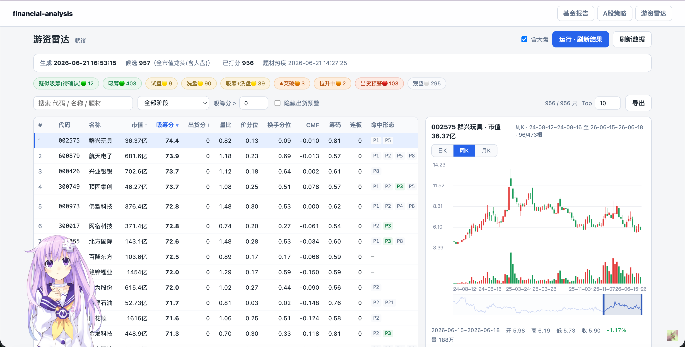

# financial-analysis

一些自用的金融量化分析工具，覆盖基金超额收益与技术信号、A 股长线/小盘/短线策略、龙虎榜/游资行为跟踪、ETF 技术雷达、参数搜索和本地可视化配置台。基金报告、A 股策略台和雷达统一整合在一个本地 Flask 工作台中，一条命令即可启动：`python run.py --port 8765`。

当前版本：v3.4.0

> 仅用于个人研究、复盘和辅助分析，不构成任何投资建议。外部数据源可能延迟、缺失或变更接口，所有结果都应结合原始数据与人工判断复核。

进一步了解项目：

- [ARCHITECTURE.md](ARCHITECTURE.md)：系统边界、数据流、存储模型和关键设计约束。
- [AGENTS.md](AGENTS.md)：面向后续编码 agent / 维护者的开发、验证和交付规则。

## 目录

- [1. 项目预览](#1-项目预览)
- [2. 功能概览](#2-功能概览)
- [3. 快速开始](#3-快速开始)
- [4. 基金分析](#4-基金分析)
- [5. A 股策略配置台](#5-a-股策略配置台)
- [6. 主力资金与 ETF 雷达](#6-主力资金与-etf-雷达)
- [7. 行业周期](#7-行业周期)
- [8. 输出文件](#8-输出文件)
- [9. 项目结构](#9-项目结构)
- [10. 运行提示](#10-运行提示)
- [11. 更新历史](#11-更新历史)
- [12. Acknowledgment](#12-acknowledgment)
- [13. License](#13-license)

## 1. 项目预览

### 1.1 基金量化报告


### 1.2 A 股策略配置台


### 1.3 游资雷达



## 2. 功能概览

所有模块统一在一个本地 Flask 工作台中运行：`python run.py --port 8765`。首页 `/` 是工作台入口，`/fund` 查看基金报告，`/stock` 进入 A 股策略台，`/radar` 进入游资雷达，数据抓取与策略计算仍由独立脚本完成。

| 模块 | 解决的问题 | 主要输出 |
| --- | --- | --- |
| 基金超额收益报告 | 对持仓基金和关注基金做跨周期超额收益比较，并提示基金经理变动 | `data/fund_report_data.json`（Flask `/fund` 页面渲染） |
| 基金技术分析 | 结合 MA、RSI、MACD、KDJ、布林带、ADX、ATR、百分位和止盈逻辑生成买卖信号 | `data/signals.json` |
| A 股长线策略 | 面向 2-5 年持有期，从细分行业龙头池中筛选质量、价值、盈利、低波、反转/动量等多因子候选 | `data/stock_advanced_strategy_results.json` |
| A 股小盘策略 | 与短线/游资雷达共用游资小盘池，复用长线基本面因子和 PIT 回测，但排除沪深300、总市值和小市值因子 | 同上；独立权重见 `data/stock_strategy_smallcap_optimized_config.json` |
| A 股短线策略 | 面向 1-5 个交易日，围绕龙虎榜、游资席位、机构共振、价量和风控因子选股 | 同上 |
| 参数搜索 | 对长线/小盘/短线策略用三个独立进程并行做 Optuna/TPE 搜索和代理回测，分别写入默认参数 | `data/stock_strategy_optimized_config.json`、`data/stock_strategy_smallcap_optimized_config.json` |
| 统一 Flask 工作台 | 在本地网页中查看基金报告、调参运行 A 股策略、保存配置、查看入选股票、周 K 小图和关键因子 | `python run.py --port 8765`（`/`、`/fund`、`/stock`、`/radar`） |
| 主力资金雷达 | 在细分行业龙头池或游资小盘池中跟踪吸筹、出货、反转、形态阶段和题材热度，支持盘中实时重算、全历史形态回放和 SW3 三级行业 20 日热度榜 | `data/capital/hot_money_ambush.json`、`data/capital/sw3_industry_heat.json` |
| ETF 技术雷达 | 对经过主清单校验并入库的 ETF 配置池复用纯技术形态与机会分；自动排除股东、回购、龙虎榜等公司行为因子 | 同一 `/radar` 页面；刷新报告见 `data/etf_pool_refresh_report.json` |
| 行业周期 | 抓取申万二级行业日线，提取周期位置、聪明资金、景气度和行业强弱特征 | `data/industry_cycle/*.json` |

## 3. 快速开始

需要 Python 3.10+。macOS、Linux 及基于 Linux/Unix 的国产系统可这样创建环境：

```bash
python3 -m venv .venv
source .venv/bin/activate
python -m pip install -r requirements.txt
```

Windows PowerShell 使用对应的虚拟环境入口：

```powershell
py -3 -m venv .venv
.\.venv\Scripts\Activate.ps1
python -m pip install -r requirements.txt
```

直接使用以下命令后台启动 Flask ：

```bash
python run.py --port 8765
```

打开：

```text
http://127.0.0.1:8765
```


## 4. 基金分析

基金模块从天天基金等数据源抓取基金基础信息、历史净值和实时估算，生成结构化报告数据 `data/fund_report_data.json`，由 Flask 工作台的 `/fund` 页面渲染。报告重点不是单只基金的绝对涨跌，而是把基金与指定基准做多周期超额收益比较。

### 4.1 能看什么

- 股票型基金和债券型基金分别展示，支持不同基准指数或基准基金。
- 近一周、1 周到 1 月、1 月到 3 月、3 月到 6 月、6 月到 1 年、1 年到 2 年、2 年到 3 年、3 年到 5 年分段比较。
- 对持仓基金、管理规模偏小/偏大、超额收益显著强弱做颜色标记。
- 检查近 20 天内基金经理是否发生变更。
- 技术分析区展示近 5 年走势、买卖点、MA/RSI/MACD/KDJ/布林带/ADX/ATR/百分位、综合评分和建议。
- 实时估算会作为最新点补入技术序列，便于当日盘中观察。

### 4.2 相关文件

- `funds.py`：配置基金列表、持仓列表和比较基准。
- `fund_fetch_data.py`：统一抓取历史净值和实时估算。
- `fund_storage.py`：基金 SQLite 核心缓存，保存历史净值、实时估算和 Scrapy 基金概况快照。
- `fund_technical_analysis.py`：生成技术指标和买卖信号。
- `fund_generate_output.py`：生成 `data/fund_report_data.json`（HTML 由 Flask `/fund` 页面渲染）。

### 4.3 基金分析命令行工具

基金分析报告使用跨平台 Python 入口，Windows、macOS、Linux 及基于 Linux/Unix 的国产系统命令一致：

```bash
python fund_data_refresh.py
```

如果境内数据源通过本地代理容易失败，可以直连运行：

```bash
python fund_data_refresh.py --no-proxy
```

`fund_run.sh` 仅保留为 Unix 系统的兼容包装；网页“刷新数据”不再依赖 Bash。刷新器始终复用启动它的 Python 解释器，并通过 `python -m scrapy` 调用 Scrapy。

## 5. A 股策略配置台

A 股模块分为长线、小盘和短线三套策略，统一由 `stock_advanced_strategies.py` 评分，既可以命令行运行，也可以通过本地 Dashboard 调参。

### 5.1 长线大盘股策略

长线策略面向 2-5 年持有期，核心目标是从申万三级细分行业龙头池中筛选财务质量稳定、有一定安全边际、流动性足够、估值和风险相对合理的股票。v3.3.0 起，长线 Dashboard 和优化器都会显式使用 `stock_crawl_segment_leaders.py` 选出的每个 SW3 topN 龙头池（`is_leader=1`），而不是全市场或宽泛指数池；本地数据完整时候选规模通常在 900 多只。细分行业龙头池先按行业内规模、ROE、成长打分，再交给长线多因子模型二次筛选；其中规模口径优先使用具体市值，若该行业任一成员缺失市值，则统一回退到官方接口返回的“市值占比”。主要因子包括：

- 规模与流动性：成交额、行业规模地位、细分行业龙头分；总市值、小市值弹性等市值因子保留原始字段，但默认权重为 0，优化器不搜索。
- 质量与盈利：ROE 稳定性、ROA、经营盈利能力、毛利资产比、现金流质量、低应计、Piotroski F 分。
- 价值与股东回报：账面市值比、盈利收益率、现金流收益率、营收市值比、滚动五年年均现金股息率、连续分红。股息率只统计截至最新交易日过去五年已经实施的现金分红，固定按五年年均，未分红期间按 0 计。
- 资金面：股东户数变化、公司回购；“近期龙虎榜”保留原始值和风险提示，但长线默认权重固定为 0，不参与参数搜索。
- 风险与稳健性：低波动、低负债、低质押、杠杆改善、资产扩张约束。
- 价格行为：一月反转、12-1 月动量、52 周高点距离、长期反转、异常换手。

### 5.2 小盘长线因子策略

小盘策略的股票池与短线策略、游资雷达完全一致，统一读取 `sw3_member.is_hot_money=1`；因子计算、持有周期和 optimizer 的 PIT walk-forward 风险目标复用长线策略。由于股票池已经限定小盘属性，小盘页不提供“必须当前沪深300”和总市值门槛，并从因子注册表、评分与搜索空间中剔除 `csi300_current`、`csi300_persistence`、`market_cap`、`size_reversal`。小盘优化权重独立保存在 `data/stock_strategy_smallcap_optimized_config.json`，加载顺序为本地文件、`meta_data_backup/stock_strategy_smallcap_optimized_config.json`、代码默认值，不会覆盖长线或短线权重。

### 5.3 短线游资小盘策略

短线策略面向 1-5 个交易日，基础成员与游资雷达的游资小盘池完全一致：近一年龙虎榜上榜次数达到门槛、属于标准 A 股且非 ST、至少有 250 根有效日线，并按近 20 个有效交易日反推流通市值中位数不高于 100 亿元。`sw3_member.is_hot_money=1` 是唯一成员来源；龙虎榜席位、机构和技术面快照只补充打分，缺失时不会把成员移出股票池。典型因子包括：

- 龙虎榜近期上榜次数、净买额、净买占成交、买方主导度、净买占流通市值。
- 游资共振数、知名游资占比、席位多样性、席位持续性、席位平均买额。
- 机构净买、机构/游资共振、机构分歧惩罚。
- 均线多头、量比、RSI 甜区、MACD 强度、短反 Alpha、涨停热度。
- 连板约束、过热惩罚、一字板/T 字板等可交易性过滤。

### 5.4 股票数据持久化

v3.1.4 起，A 股主数据不再以 `data/stock_data/CN_{code}_{name}.json` 作为主链路，而是统一写入 `data/stock_data.sqlite3`。`stock_storage.py` 负责建库、连接、schema 版本、upsert 和旧 JSON 导入：`stock_meta` 以 6 位股票代码为主键，保存名称、抓取时间、行业、质押、日线统计，以及财报、指标、分红、候选来源等 JSON blob；`stock_history` 按 `(code, date)` 存前复权日线 OHLCV、换手、涨跌幅和估值字段；`sw3_member` 保存申万三级成分、官方市值占比和本地主库回补后的市值/ROE/成长字段；`index_nav` / `index_nav_meta` 保存 510310、510580 等基准 ETF NAV。主键从文件名切到代码后，股票改名只更新 `name`，不会造成旧缓存失联。

股票爬虫、刷新、策略、主力资金雷达框架和优化器都改为优先读写 SQLite：`stock_crawl_price_valuation.py` 先维护细分行业龙头池并把长历史写入 `stock_history`，`stock_crawl_fundamentals.py --mode full` 补齐龙头股票基本面；游资小盘建池完成筛选后，再为本轮最终 `is_hot_money=1` 成员补齐估值、财报、指标、分红和质押。任一小盘成员补齐失败时保留上一份有效股票池，并阻止策略快照更新，避免新池与旧数据混合。`stock_data_refresh.py` 的健康检查和 fallback 面向 DB 表计数，`stock_advanced_strategies.py` 用 `iter_history()` / `db_signature()` 构建和失效候选池缓存，`stock_strategy_optimizer.py` 优先从 `index_nav` 读取 510310+510580 等权基准。`stock_storage.import_stock_data_dir()` 保留旧 `CN_*.json` 批量导入，便于已有缓存过渡。

当前 schema 通过 `stock_meta.instrument_type` 区分 `stock` 与 `etf`。两者复用 `stock_history` 的前复权行情，但 `list_codes()`、`codes_with_history()` 和 `iter_history()` 默认只返回股票；只有显式传入 `instrument_type=None` 才扫描全部证券。这个隔离保证 ETF 不会进入财报、股东、质押、回购、龙虎榜或股票策略任务。

### 5.5 参数搜索与可视化

`stock_strategy_optimizer.py` 会搜索策略权重和硬过滤参数。长线与小盘采用同一套 **Point-in-Time (PIT) walk-forward 回测**框架：每 60 个交易日取一个折起点、固定持有 60 个交易日，以当时可见的财报、价格、估值和分红重算因子，再对比 510310 沪深300ETF 与 510580 中证500ETF 按日等权再平衡的混合基准。小盘仅把候选集合替换为当前游资小盘池，并排除指数与市值因子；长线仍限制为 SW3 细分龙头池。短线继续使用自身的短周期真实前推和代理评分回测。可分别用 `--strategy long`、`--strategy smallcap`、`--strategy short` 单独重跑并保留其他策略配置。

> 注意：受本地约 10 年日线与基准 ETF 覆盖区间所限，PIT 有效折数有限，超额数值是相对而非可直接兑现的收益。小盘回测使用“当前游资小盘成员回看历史”，存在幸存者偏差。默认长线/小盘/短线各搜索 1500 次，三个独立进程并行运行，整体时间取决于本地缓存规模。

Dashboard 支持：

- 长线/小盘/短线 tabs 切换。
- 调整硬过滤参数、因子权重、输出数量和最低分。
- 运行策略、保存配置、重置参数。
- 直接触发长线/小盘/短线各 1500 次参数搜索，并查看后台搜索状态。
- 展示候选数、入选数、平均分、分数区间、按当前正权重计算的加权覆盖率，以及财务/估值、价量、资金面等分项覆盖；筛选解释和主要因子贡献继续使用同一套后端因子结果。
- 长线专属“策略走势”按钮：默认参数直接展示 `data/stock_strategy_best_fold_paths.svg`，非默认参数会按当前配置重新生成自定义 SVG。
- “导出”按钮按当前策略的输出数量导出 txt，每行格式为 `股票代码,股票名,`。
- 三种策略的入选股票表格均内置固定范围简易周 K 线，不提供拖拽或缩放。
- 支持精确搜索代码/名称，把匹配股票临时加入当前结果表查看因子与周 K。


### 5.6 常用CLI命令

首次使用推荐后台跑以下命令组合

```bash
python stock_data_refresh.py --mode full --no-proxy
python stock_strategy_optimizer.py --iterations 1500
```

股票数据刷新

```bash
python stock_data_refresh.py --mode full --timeout 1800 --no-proxy
python stock_data_refresh.py --mode quick --timeout 1800
python stock_data_refresh.py --mode capital-only --timeout 1800
```

股票策略

```bash
python run.py --port 8765
python stock_advanced_strategies.py --persist
python stock_advanced_strategies.py --persist --rebuild-cache
python stock_advanced_strategies.py --strategy long --json
python stock_advanced_strategies.py --strategy short --json
python stock_strategy_optimizer.py --iterations 1500
```

单独维护申万三级龙头与行业热度

```bash
python stock_crawl_segment_leaders.py crawl
python stock_crawl_segment_leaders.py recrawl
```

`crawl` 和 `recrawl` 在龙头池成功生成后，会同步刷新近 20 个共同交易日的三级行业热度报告；默认 `show` 只读取已有龙头池，不联网、不重算。完整股票刷新通过 `stock_crawl_price_valuation.py` 调用同一流程，因此也会更新该报告。

行业成交额历史仍以申万指数日频数据为主。当申万仅缺少紧邻的一个已收盘交易日时，刷新器会通过无需 Token 的 AkShare `stock_zh_a_spot()` 读取一次新浪全 A 收盘快照，再按当前 SW3 成分汇总该日成交额；这个补位只用于相邻一天，不承担多日历史回补。快照日期、收盘状态、全市场行数、成分完整度和行业覆盖必须全部通过校验，且结果写入独立缓存以避免同一快照重复请求；任何门槛失败都会保留上一份原子报告。

`stock_data_refresh.py` 的 full 流程会先刷新细分行业龙头行情、估值与基本面，随后刷新基准 ETF、指数成分和资本事件；游资小盘筛选完成后，对最终成员补齐长线因子所需的估值与基本面，再刷新席位/技术快照，最后自动运行 `stock_advanced_strategies.py --persist --rebuild-cache` 生成最新策略结果并预构建候选池缓存。申万三级 membership 默认每轮滚动刷新最旧 15 个行业：legulegu 总表可用时优先使用 legulegu 成分接口，成员接口失败才回退官方；总表不可用时直接用官方数据刷新最旧 15 个。日常打开 Flask 不再启动时重算候选池；如果只是修改因子权重、最低分或输出数量，Dashboard 会复用缓存中的候选池并快速重打分。

A 股个股日线按 `新浪 -> 腾讯 -> 东财` 依次回退，全部来源都返回空数据时会把该股票列入首轮失败。等其余股票抓取和首轮写库全部结束后，失败代码会逐只再刷新一次；只有复试后仍失败的股票才写入 `data/stock_data_refresh_report.json`，并记录最终失败阶段与最终异常。报告同时提供 `retry_attempted`、`retry_recovered`、`retry_failed` 统计。ETF 优先使用基金专用行情接口，再回退到同一套公开日线源。

## 6. 主力资金与 ETF 雷达

`stock_hot_money_radar.py` 是雷达计算入口，按「潜伏吸筹 → 试盘/洗盘 → 突破/拉升 → 出货预警」理解股票短线资金行为，同时允许 ETF 配置池复用不依赖公司数据的技术形态。Flask `/radar` 页面负责切换候选池、展示排序与解释、读取 K 线，并按需触发离线计算或全量刷新。

### 6.1 候选池与排序口径

| `--pool` | 成员来源 | 主排序 | 适用边界 |
| --- | --- | --- | --- |
| `leader` | `sw3_member.is_leader=1`，即 SW3 细分行业龙头池 | 机会分 | 默认池；结合技术形态、公司资金面与题材解释 |
| `hotmoney` | `sw3_member.is_hot_money=1`，与 A 股短线策略共用游资小盘池 | 反转分 | 机会分辅助观察；偏向寻找不过热、不拥挤的短线反弹候选 |
| `etf` | `stock_etf_pool.py` 配置，经 ETF 主清单校验且已以 `instrument_type=etf` 入库 | 技术机会分 | 不抓取或使用财报、股东户数、回购、质押、龙虎榜等公司层数据；当前尚未做 ETF 专项有效性验证 |

机会分不是上涨概率。它先把吸筹原始分和连续出货原始分分别转换为当前候选池内的横截面百分位，再按 `吸筹百分位 ×（1 − 0.5 × 出货百分位 / 100）` 折价。阶段标签只描述当前命中的 P1–P26 结构，不直接等同于排序分。

ETF 池通过 `stock_etf_pool.py` 维护。`stock_crawl_etf_pool.py` 默认先用公开 ETF 主清单严格校验代码，再只抓取前复权 OHLCV、成交额、涨跌幅和换手率；主清单不可用时会停止刷新，不在主清单中的配置则记录为无效并跳过，避免普通股票或 LOF 仅凭六位代码混入。

### 6.2 运行模式

核心模式包括：

- `ambush`：默认模式，读取 `--pool` 指定的候选池，输出吸筹分、出货分、阶段、形态和题材/分类信息。
- `patterns`：把游资形态 playbook 落到股票与板块数据上，输出形态匹配与验证结果。
- `verify`：复盘吸筹分与形态信号的后续收益、分层和 IC。
- `distribution`：复盘出货分候选特征，做 0.05 步长权重网格搜索和消融实验。
- `accumulation`：复盘 `chip / position / cmf_eff / P1 / P2 / P3 / P5 / P21 / P23 / P24 / P25 / 股东户数变化 / 公司回购` 十三个吸筹候选特征；P2/P5/P23/P24/P25/公司回购固定各 5%，其余七项在剩余 70% 中按 0.05 步长做权重网格搜索和消融实验。
- `latent`：在 `ambush` 结果上用低位、低拥挤、吸筹、妖股基因和公司证据筛出左侧观察名单；新闻题材只作催化剂展示，不进入排序。
- `watch`：预留盘中监控状态文件，当前仍以离线数据推断为主。

```bash
python stock_hot_money_radar.py
python stock_hot_money_radar.py ambush
python stock_hot_money_radar.py ambush --pool hotmoney
python stock_hot_money_radar.py ambush --pool etf
python stock_hot_money_radar.py patterns
python stock_hot_money_radar.py patterns --pool leader --pattern-max 24 --jobs 6
python stock_hot_money_radar.py patterns --pool leader --pattern-min 25 --pattern-max 26 --jobs 6
python stock_hot_money_radar.py watch
python stock_hot_money_radar.py verify
python stock_hot_money_radar.py distribution
python stock_hot_money_radar.py accumulation
python stock_hot_money_radar.py latent --pool hotmoney
python stock_crawl_news.py --no-proxy --pool hotmoney
python stock_crawl_etf_pool.py
python stock_radar_fresh_data.py
```

`patterns` 支持用 `--pattern-min` / `--pattern-max` 限定形态编号区间，并用 `--jobs` 按股票并行回测。并行实现会在各进程内先聚合日期级充分统计量，再合并计算逐日超额、胜率、Newey-West HAC 与 BH-FDR，避免传输和保存数百万条逐股票日明细。

`--as-of YYYY-MM-DD` 可让 `ambush` / `latent` 只使用该日及以前的 bar 做 PIT 历史复盘，并禁用最新题材缓存以防信息泄漏。`--exclude-large-cap` 只对 `leader` 池生效；`hotmoney` 已在建池时完成小盘过滤，ETF 没有公司总市值过滤语义。

`stock_radar_fresh_data.py` 是跨平台全量刷新入口，不按候选池拆分：每次都会刷新 `stock_etf_pool.py` 中的 ETF 行情、全量股票、申万二级板块历史和题材候选。ETF 仅抓取行情，不抓取财务、股东户数、回购、龙虎榜等公司层数据。刷新器最后重建默认 `leader` 结果；切到 `hotmoney` 或 `etf` 后需再运行一次雷达，池选择不会缩小底层刷新范围。`stock_radar_fresh_data.sh` 只为 Unix 手工调用保留，网页不依赖它。

### 6.3 前端能力

- `/radar` 可切换细分龙头、游资小盘和 ETF 三类候选池，并按各自生产口径排序。
- 页面展示机会分、吸筹分、连续出货分/预警、反转分、阶段分布、题材或 ETF 类别、命中形态解释，以及市值或基金规模。
- “空仓观望”统一改名为“观望”。
- 支持隐藏出货预警、切换是否包含大盘股、运行刷新结果、重爬数据。
- 支持盘中实时行情开关：腾讯批量行情优先，新浪批量行情备用，东方财富全 A 快照兜底；开启后页面每 3 分钟刷新当前雷达股票池，只在内存中重算形态与分数，不写回离线结果文件。
- 实时价格展示保留接口原始现价，形态计算会把当日涨跌幅投影到本地前复权日线基准，避免把不复权实时价直接拼进前复权序列；实时成交量、成交额和换手率保留 `raw_*` 原始累计值，并按内置 A 股 U 型日内成交曲线估算全天值后供量比、换手分位、CMF、筹码和放量形态使用。
- 二级行业筛选支持多选、热度 Top10、可调热度阈值和当前筛选结果全选，便于在行业数量较多时快速聚焦高热度方向。
- “三级行业热度”按钮懒加载 `data/capital/sw3_industry_heat.json`，同时展示全部有效三级行业的近 20 日成交额排名，以及全部满足“末 5 日成交份额增长且 20 日趋势为正”的升温行业；每个行业给出成交额、日均成交额、当前成分市值及覆盖率，并用 20 日热度指数折线展示变化。摘要会标明最新日来源，使用 AkShare/Sina 成分汇总的行业会单独显示汇总天数。两张长榜各自滚动，排名不会因展示而重算。
- K 线支持日/周/月聚合、拖拽平移、缩放和全历史范围条；“形态回测”会按每日当时可见数据逐日回放生产买卖点，并把普通买点、动量点、疑似吸筹和出货预警标记在日 K 上。
- ETF 模式会把行业筛选切换为 ETF 类别，并明确标注“股票池实测、ETF 待专项验证”。
- “导出”按钮按当前候选池的页面排序导出 TopN，输入框默认 10，每行格式为 `股票代码,股票名,`。

### 6.4 输出文件

- `data/capital/hot_money_ambush.json`：吸筹分、出货分、形态阶段和题材热度。
- `data/capital/hot_money_patterns.json` / `.csv`：形态匹配结果。
- `data/capital/hot_money_pattern_verify.json`：形态事件复盘。
- `data/capital/hot_money_watch.json`：盘中监控状态占位。
- `data/capital/hot_money_verify.json`：吸筹分复盘结果。
- `data/capital/hot_money_distribution_experiment.json`：出货分权重网格搜索和消融实验结果。
- `data/capital/hot_money_accumulation_experiment.json`：十三项原始特征吸筹总分权重网格搜索和消融实验结果。
- `data/capital/hot_money_latent.json`：低位潜伏观察名单；它不是买点触发器。
- `data/capital/sw3_industry_heat.json`：申万三级行业统一 20 日成交额、当前成员市值快照、全部有效行业热门排名、全部正向升温行业排名与每日图表序列。
- `data/capital/sw3_akshare_latest_cache.json`：通过日期、全市场快照与 SW3 membership 校验后的最新单日成分汇总缓存；它不是历史数据源或可展示报告。
- `data/etf_pool_refresh_report.json`：ETF 配置、主清单校验、无效代码和行情刷新结果。

### 6.5 使用边界

- 盘中没有席位级实时数据，雷达输出是行为推断，不是席位实锤。
- 潜伏吸筹可能持续多天到数周，高分不代表马上启动。
- 机会分、反转分和阶段把握度都是排序或解释信号，不是未来收益概率，也不构成交易指令。
- 三级行业“最热门”按统一 20 个交易日成交额排序；“逐渐上升”按行业日成交额占全部有效三级行业的份额，综合末 5 日相对首 5 日增幅和趋势相关性排序。两者都是相对活跃度，不是行业收益预测。
- 行业市值是当前 SW3 membership 成分的总市值快照。现有 membership 会排除 ST、北交和部分新股，因此报告始终同时给出成员覆盖率；覆盖不完整时页面显示“约”，不能解读为官方完整行业总市值。
- 个别当前行业在申万“指数详情趋势”接口中可能停更。报告会优先使用精确 `bargainsum`；仅对缺失的近 20 日，用同一官方站点的行业成交额份额和其他精确行业汇总反推估算，并在行业与每日记录中设置 `amount_is_estimate`，页面以“约/含估算”标注。若份额接口本轮临时返回空，只允许续用上一份已通过完整性校验且明确标为估算的日度点，不会把旧 AkShare 派生点滚动成多日历史。
- AkShare/Sina 只补申万之后紧邻的一个已收盘交易日：成交额来自全 A 收盘快照按 SW3 成分求和，属于“成分汇总”而不是申万指数直接值，也不标成份额反推估算。交易日间隔超过一天、快照不完整或行业成分覆盖不足时不拼接、不补零，并保留旧报告。
- ETF 当前只复用纯技术启发式并重标剩余权重，股票池中的形态有效性不能直接外推到 ETF；使用前应单独做事件研究。
- `阶段·把握` 中的阶段来自命中形态。买入阶段继续混合形态强度、吸筹分和出货冲突分；出货阶段的把握已按2017–2026全历史PIT事件做时间切分校准，仅用吸筹分与连续出货分估计未来5/10/20日下跌方向的一致性。观望表示“暂无明显阶段信号”的可信度，不等同于吸筹分或简单形态计数。
- `出货预警` 在同一交易日命中 P14/P15/P16/P17/P19/P20/P22/P26 中任意一个即触发；每个形态去重后记 1 分，P18/P11 不触发。列表阶段与 K 线“形态回测”卖点共用该口径。
- `疑似吸筹（待确认）` 要求 P1–P26 全部未命中且吸筹分达到 35 分；“形态回测”从第 40 根 K 线开始按当日可见资金面逐日计算，并以绿色“疑”买点标记。
- “形态回测”的普通买点为 P1/P2/P3/P5/P21/P23/P24/P25 任意一个命中；P23/P25 虽保留实验标签，仍按当前产品口径标记绿色买点。
- 吸筹总分的十三项原始特征为 `chip / position / cmf_eff / P1 / P2 / P3 / P5 / P21 / P23 / P24 / P25 / 股东户数变化 / 公司回购`；当前线上公式为 `0.05*公司回购 + 0.10*chip + 0.10*position + 0.10*cmf_eff + 0.10*股东户数变化 + 0.10*(P1+P3+P21) + 0.05*(P2+P5+P23+P24+P25)`。P1/P5 在当前复测中小盘更有效，P2 大盘更有效。形态命中为 100、未命中为 0；缺股东户数变化按中性 50，近 90 日无回购按 0。普通股完全未命中形态时理论最高 40 分，股东数据缺失且有回购时最高 35 分，公司资金面完全缺失时最高 30 分；ETF 排除并重标公司行为权重后最高约 29.4 分。
- 连续出货分的十一项原始特征为 `P14 / P15 / P16 / P17 / P19 / P20 / P22 / P26 / 近期龙虎榜 / technical / divergence`；当前线上公式为 `0.05*(P14+P15+P20+P22) + 0.10*(P16+P17+P19+P26+近期龙虎榜) + 0.15*technical + 0.15*divergence`。形态与龙虎榜命中值为 1，否则为 0；`technical` 与 `divergence` 为 0–1，其中 `divergence` 使用原始分，不使用吸筹侧反向后的 `div_eff`。
- 调整出货权重前先跑 `python stock_hot_money_radar.py distribution` 查看 train、validation 与消融结果。
- 调整吸筹总分权重前先跑 `python stock_hot_money_radar.py accumulation`，并同时检查 train、validation 与消融结果。


## 7. 行业周期

`industry_cycle_engine.py` 是行业周期的第一版可运行引擎，基于本地 `data/plate_data.sqlite3` 的申万二级行业日线，不依赖实时网络即可计算周期位置、聪明资金、景气度和行业强弱。`plate_crawl_history.py` 负责抓取申万二级行业日度分析数据，`plate_storage.py` 负责 SQLite schema、字段说明和增量写入。

计划覆盖的数据维度包括：

- 宽基与市场指数：万得全 A（除科创板）、上证指数、沪深300除金融、上证50、中证500、中证1000、国证2000、创业板指、创业板50、港股、短债、长债。
- 行业指数：申万一级行业指数周期位置（31 个）、热门行业指数周期位置（10+）。
- 大宗商品：黄金、白银、原油的周期位置。
- 行业强弱：每周更新的行业强弱模型数据。
- 聪明资金行为：周期底部更有效的进场动作模型。
- 景气度：行业景气度跟踪。

当前版本先覆盖申万二级行业的价格位置、估值分位、换手/成交额加速、20/60/120 日预测和底部/复苏/上行/高位/回落阶段识别，后续再继续扩展到宽基、商品和更多外部景气度数据。

```bash
python plate_crawl_history.py --no-proxy
python industry_cycle_engine.py --write
```

## 8. 输出文件

| 文件 | 说明 |
| --- | --- |
| `data/fund_report_data.json` | 基金超额收益和技术信号报告数据，由 Flask `/fund` 页面渲染（生成物，不入库） |
| `data/signals.json` | 基金技术信号 |
| `data/fund_data.sqlite3` | 基金核心缓存，包含历史净值、实时估算和 Scrapy 基金概况快照 |
| `data/stock_advanced_strategy_results.json` | A 股长线/小盘/短线策略结果 |
| `data/stock_strategy_candidate_cache.json` | A 股长线/小盘/短线候选池缓存，由 `stock_data_refresh.py` 刷新后重建，用于 Dashboard 快速调参 |
| `data/stock_strategy_optimization.json` | 参数搜索过程和结果摘要 |
| `data/stock_strategy_optimized_config.json` | Dashboard 默认读取的优化参数；optimizer 只写入 data 路径，data 文件缺失时前端可兜底读取 `meta_data_backup/stock_strategy_optimized_config.json` |
| `data/stock_strategy_smallcap_optimization.json` | 小盘策略独立参数搜索过程和回测摘要 |
| `data/stock_strategy_smallcap_optimized_config.json` | 小盘独立优化权重；缺失时回退 `meta_data_backup/stock_strategy_smallcap_optimized_config.json`，再回退代码默认值 |
| `data/stock_strategy_best_fold_paths.svg` | 长线默认参数历史折走势小图矩阵 |
| `data/capital/segment_leader_pool.json` | 申万三级细分行业龙头池，包含行业内龙头分、规模口径和候选来源 |
| `data/capital/sw3_industry_heat.json` | 申万三级行业近 20 个共同交易日热度报告，含成交额、当前成员市值覆盖、全部有效行业热门排名、全部正向升温行业排名和日度图表序列 |
| `data/capital/sw3_akshare_latest_cache.json` | 通过日期、全市场快照与 SW3 membership 校验后的最新单日成分汇总缓存，不是展示报告 |
| `data/stock_data.sqlite3` | 股票/ETF 证券主数据库：`stock_meta.instrument_type` 隔离品种，`stock_history` 存长历史 OHLCV 与估值序列，`sw3_member.is_hot_money` 存游资雷达/A股短线共用池成员，`short_signal_snapshot` 存龙虎榜席位与技术面补充信号，`index_nav` / `index_nav_meta` 存策略基准 ETF NAV |
| `data/etf_pool_refresh_report.json` | ETF 配置池的主清单校验、有效/无效代码和行情刷新结果 |
| `data/plate_data.sqlite3` | 申万二级行业日线缓存，供题材热度、游资形态和行业周期使用 |
| `data/stock_data/CN_*.json` | 旧版个股 JSON 缓存；v3.1.4 主流程不再依赖，可通过 `stock_storage.import_stock_data_dir()` 批量导入 SQLite |
| `data/stock_data_refresh_report.json` | 数据刷新步骤、耗时、健康检查和结构化失败明细；`failures[]` 记录股票代码、名称、失败阶段与异常内容 |
| `data/capital/theme_candidates.json` | SW2 板块热度与个股题材跟踪关系 |
| `data/capital/hot_money_ambush.json` | 主力资金吸筹分、出货分、阶段和形态输出 |
| `data/capital/hot_money_patterns.json` / `.csv` | 游资形态匹配输出 |
| `data/capital/hot_money_pattern_verify.json` | 游资形态事件复盘输出 |
| `data/capital/hot_money_watch.json` | 实时交易监控状态占位 |
| `data/capital/hot_money_verify.json` | 吸筹分命中验证输出 |
| `data/capital/hot_money_accumulation_experiment.json` | 十三项原始特征吸筹总分权重实验输出 |
| `data/capital/hot_money_latent.json` | 低位、安静、吸筹与历史活跃基因构成的潜伏观察名单 |
| `data/industry_cycle/*.json` | 行业周期位置、聪明资金、景气度、行业强弱和运行报告 |

## 9. 项目结构

```text
.
├── app/                           # Flask 统一工作台、路由、模板和静态资源
├── run.py                         # Flask 本地启动入口
├── refresh_workflow.py            # 跨平台子进程环境、日志和失败即停止编排
├── fund_data_refresh.py           # 基金跨平台全量刷新入口
├── fund_*.py                     # 基金数据、技术分析、回测和报告生成
├── fund_storage.py                # 基金 SQLite 缓存 schema、读写和导入工具
├── funds.py                      # 基金列表和基准配置
├── stock_advanced_strategies.py   # A 股长线/小盘/短线策略引擎
├── stock_strategy_optimizer.py    # 参数搜索和代理回测
├── stock_data_refresh.py          # 股票数据刷新编排
├── stock_crawl_common.py          # 股票爬虫公共文件、JSON、历史行情和日线统计工具
├── stock_storage.py               # A 股 SQLite 持久化层、schema、导入和读写工具
├── stock_crawl_segment_leaders.py # 申万三级行业 membership 与细分行业龙头池
├── sw3_industry_heat.py            # 申万三级行业20日成交额、趋势榜与原子报告
├── sw3_akshare_latest.py            # AkShare/Sina 最新相邻交易日成分汇总与质量门槛
├── stock_crawl_*.py               # 股票基础数据、指数池、龙虎榜/资金数据抓取
├── stock_etf_pool.py               # 雷达 ETF 配置、展示名称和分类
├── stock_crawl_etf_pool.py         # ETF 主清单校验与纯行情刷新
├── stock_hot_money_radar.py       # 主力资金吸筹分、形态和验证
├── stock_hot_money_risk_factors.py # P17/P19/P22 精简风险因子层，供后续研究复用
├── stock_crawl_news.py             # 潜伏观察模式的可选新闻/题材催化剂数据层
├── stock_theme_candidates.py      # SW2 板块热度与个股题材匹配
├── stock_radar_fresh_data.py      # 股票、ETF、板块和雷达跨平台全量刷新入口
├── stock_radar_fresh_data.sh      # Unix 兼容包装器
├── plate_crawl_history.py         # 申万二级行业日线抓取
├── plate_storage.py               # 板块/行业 SQLite 持久化层
├── industry_cycle_engine.py       # 行业周期位置、景气度和强弱引擎
├── research_p15_optimization.py   # P15 双池只读 PIT 审计
├── mf_pilot.py                    # 主力/超大单净占比的断点续爬研究 pilot
├── stock_fix_volume_units.py      # stock_history 成交量单位修复工具
├── app/routes/radar.py            # 游资雷达 Flask 路由
├── app/services/radar_service.py  # 游资雷达页面服务
├── app/static/js/radar.js         # 游资雷达前端交互与 K 线
├── app/static/vendor/live2d-widget # 本地化 Live2D 小组件运行时资源
├── tests/                         # 核心逻辑和股票策略单测
├── img/                           # README 和说明文档展示图
└── data/                          # 本地缓存、策略结果和刷新报告
```

## 10. 运行提示

- 外部数据接口可能很慢或超时。网页全量刷新任务上限为 3 小时；若单独调试底层 `stock_data_refresh.py`，可用 `python stock_data_refresh.py --mode full --no-proxy --timeout 1800` 将每个外部步骤上限设为 1800 秒。
- 境内行情接口通过本地代理有时会失败，可使用 `--no-proxy` 或 `FUND_CRAWL_NO_PROXY=1`。
- Dashboard 日常打开不会自动重算候选池；需要最新数据时用页面按钮或 CLI 手动刷新。
- 短线策略强依赖龙虎榜/资金数据；游资雷达还依赖 SW3 龙头池、`stock_history`、`plate_data.sqlite3` 和 `theme_candidates.json`。
- `stock_radar_fresh_data.py` 不接受 pool 参数，每次都会刷新全量股票、ETF、板块和题材数据。
- 三级行业热度刷新需要逐个读取约 336 个申万三级指数的日频成交额，并使用 `data/capital/sw3_industry_heat_history_cache.json` 做两小时内的失败续传。申万只落后一个已收盘交易日时才会额外请求一次无需 Token 的 AkShare/Sina 全 A 快照，并复用 `data/capital/sw3_akshare_latest_cache.json`；多日缺口、日期/全市场/成分覆盖校验失败、接口超时或有效行业不足 80% 时都不会覆盖上一份完整报告，页面仍读取旧快照。
- ETF 与股票共用 `stock_history`，但 `stock_meta.instrument_type` 必须保持正确；股票全库扫描默认排除 ETF，避免误抓公司层数据。
- 所有策略结果都来自本地缓存和可得数据，缺失数据会影响排序和评分。

## 11. 更新历史

#### Update v3.4.0  2026.7.18
雷达新增龙头、游资小盘和 ETF 三池切换、形态回放与潜伏观察；上线 SW3 三级行业热度；刷新链路改为跨平台 Python 编排，并增强行情重试、证券隔离和滚动五年股息口径。

#### Update v1.1  2021.7
新增该基金的基金经理管理规模提示，小于100亿标红（表示管理规模小），大于300亿标绿（表示管理规模较大）。

#### Update v1.2  2022.1
在fund.py文件中会更新我的持仓，希望市场能让我们写代码赚的辛苦钱持续稳健增值。我的持仓风格是多元化全球资产配置，股8债2，投资中国、美国、香港、日本市场。

#### Update v1.2  2022.5
增加了对中低风险基金的详细对比支持。

#### Update v1.3  2022.11
增加了对中信股指期货持仓的统计。

#### Update v1.4  2023.1
代码细节优化。

#### Update v1.4.1  2023.7.22
适配基金估值下线后的天天基金前端。

#### Update v2.0  2026.4.15
增加技术面指标。增加技术面买卖点推荐。增加html展示。

#### Update v2.0.1  2026.4.15
修复百分位计算问题。

#### Update v2.0.2  2026.4.18
新增买卖点判断逻辑以及止盈卖出点位。

#### Update v2.0.3  2026.4.20
新增60日趋势线指标，新增参数配置功能。修改了repo名字。

#### Update v2.1.0  2026.4.23
新增回测能力 `fund_backtest.py`。

#### Update v2.1.0.post1  2026.4.24
更新股票分析相关骨架。

#### Update v2.2.dev0  2026.5.7
更新左侧交易股票分析相关代码。

#### Update v2.2.dev1  2026.6.1
修复基金爬虫阻塞请求、数据缺失静默吞错、百分位边界、股票文件名兼容与股票抓取失败可见性问题；新增核心纯函数单测。

#### Update v3.0  2026.6.6
上线 A 股长线/短线策略：引入多因子选股、龙虎榜短线模型、数据刷新、参数搜索和本地策略配置台。

#### Update v3.0.1  2026.6.12
优化基金报告生成与数据抓取稳定性，修复净值、估值、回测和短历史信号中的若干边界问题。

#### Update v3.1  2026.6.13
新增实验性游资雷达，扩展长线/短线因子库，并将长线参数搜索升级为 PIT walk-forward 回测以降低前视偏差。

#### Update v3.1.1  2026.6.13
优化长线回测展示和基准对比，统一基金报告与 A 股策略台到同一个本地工作台，并清理旧报告链路。

#### Update v3.1.1.post1  2026.6.14
优化股票爬虫速度和复用结构，小幅调整游资雷达与 Flask 页面体验。

#### Update v3.1.2  2026.6.15
重构 A 股刷新与策略缓存链路，让 Dashboard 复用候选池快速重打分，并为行业周期特征预留能力骨架。

#### Update v3.1.2.post1  2026.6.15
修复股票刷新 fallback 的打印问题，并移除旧策略台入口，统一从本地工作台启动。

#### Update v3.1.3  2026.6.15
基金核心缓存迁移到 SQLite；股票数据刷新同步提速，增强行情 fallback、并发抓取和阶段耗时输出。

#### Update v3.1.4  2026.6.15
A 股主数据迁移到 SQLite，股票代码成为稳定主键；长线搜索升级为 300 次 Optuna/TPE，游资雷达改为吸筹分/拉升分双分制。

#### Update v3.2.0  2026.6.20
长线候选切到细分行业龙头池，刷新链路和优化器同步改为更贴近实盘的 60 日 walk-forward 口径。

#### Update v3.3.0  2026.6.21
上线 `/radar` 游资雷达页面，并补齐长线 SW3 龙头池、策略走势、题材候选、板块缓存和行业周期引擎。

#### Update v3.3.1  2026.6.22
修正长线策略与 optimizer 的实盘一致性，并增强游资雷达的行业热度、市值、相似行业和出货预警展示。

#### Update v3.3.2  2026.6.25
优化策略与 optimizer 性能，加入 NumPy/矩阵缓存、实验并行、增量日线写入和 SQLite 批量同步。

#### Update v3.3.3  2026.7.9
短线搜索改为 Optuna 并与长线多进程并行；游资雷达新增二级行业筛选、实时行情重算、前复权价格投影和 U 型成交量估算。

#### Update v3.3.4  2026.7.13
强化基金配置与数据刷新安全，修正策略回测时点与缓存边界，新增游资雷达 P1/P25 吸筹因子。

## 12. Acknowledgment

感谢东方财富、新浪财经、腾讯财经、百度、同花顺、AkShare 以及相关公开数据源。爱您们，感恩！

## 13. License

本项目基于 [MIT License](LICENSE) 开源，详见仓库根目录的 `LICENSE` 文件。
