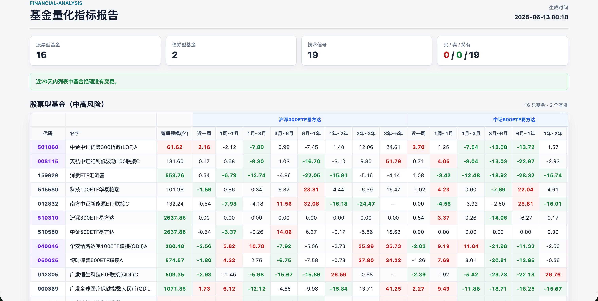
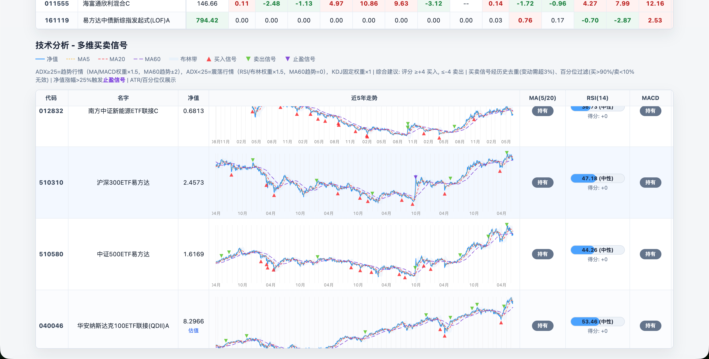
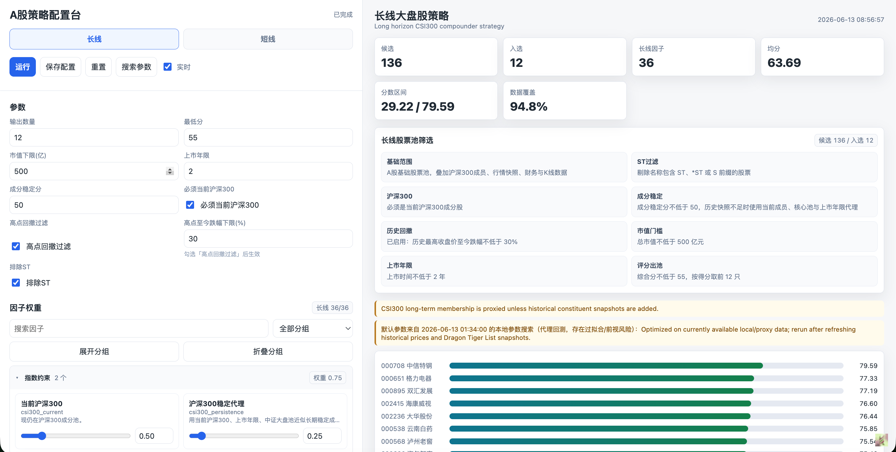
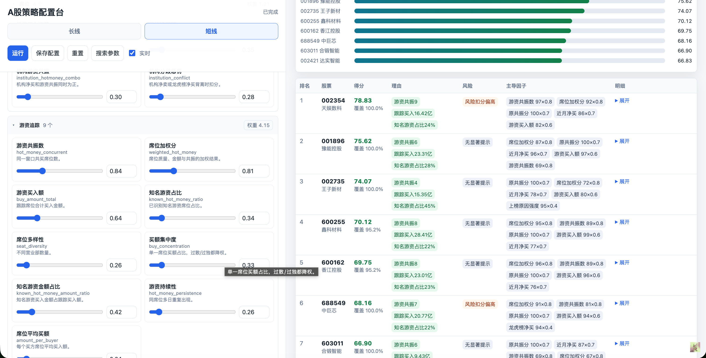

# financial-analysis

一些自用的金融量化分析工具，覆盖基金超额收益与技术信号、A 股长线/短线策略、龙虎榜/游资行为跟踪、参数搜索和本地可视化配置台。基金报告与 A 股策略台统一整合在一个本地 Flask 工作台中，一条命令即可启动：`python run.py --port 8765`。

当前版本：v3.3.0

> 仅用于个人研究、复盘和辅助分析，不构成任何投资建议。外部数据源可能延迟、缺失或变更接口，所有结果都应结合原始数据与人工判断复核。

## 目录

- [1. 项目预览](#1-项目预览)
- [2. 功能概览](#2-功能概览)
- [3. 快速开始](#3-快速开始)
- [4. 基金分析](#4-基金分析)
- [5. A 股策略配置台](#5-a-股策略配置台)
- [6. 游资雷达](#6-游资雷达)
- [7. 行业周期](#7-行业周期)
- [8. 输出文件](#8-输出文件)
- [9. 项目结构](#9-项目结构)
- [10. 运行提示](#10-运行提示)
- [11. 更新历史](#11-更新历史)
- [12. Acknowledgment](#12-acknowledgment)

## 1. 项目预览

### 1.1 基金量化报告





### 1.2 A 股策略配置台





## 2. 功能概览

所有模块统一在一个本地 Flask 工作台中运行：`python run.py --port 8765`。首页 `/` 是工作台入口，`/fund` 查看基金报告，`/stock` 进入 A 股策略台，`/radar` 进入游资雷达，数据抓取与策略计算仍由独立脚本完成。

| 模块 | 解决的问题 | 主要输出 |
| --- | --- | --- |
| 基金超额收益报告 | 对持仓基金和关注基金做跨周期超额收益比较，并提示基金经理变动 | `data/fund_report_data.json`（Flask `/fund` 页面渲染） |
| 基金技术分析 | 结合 MA、RSI、MACD、KDJ、布林带、ADX、ATR、百分位和止盈逻辑生成买卖信号 | `data/signals.json` |
| A 股长线策略 | 面向 2-5 年持有期，从细分行业龙头池中筛选质量、价值、盈利、低波、反转/动量等多因子候选 | `data/stock_advanced_strategy_results.json` |
| A 股短线策略 | 面向 1-5 个交易日，围绕龙虎榜、游资席位、机构共振、价量和风控因子选股 | 同上 |
| 参数搜索 | 对长线/短线策略做 Optuna/TPE 搜索和代理回测，写入优化后的默认参数 | `data/stock_strategy_optimized_config.json` |
| 统一 Flask 工作台 | 在本地网页中查看基金报告、调参运行 A 股策略、保存配置、查看入选股票、周 K 小图和关键因子 | `python run.py --port 8765`（`/`、`/fund`、`/stock`、`/radar`） |
| 游资雷达 | 在细分行业龙头池中跟踪吸筹分、出货预警、形态阶段和题材热度，并提供 K 线详情与 TopN 导出 | `data/capital/hot_money_ambush.json` |
| 行业周期 | 抓取申万二级行业日线，提取周期位置、聪明资金、景气度和行业强弱特征 | `data/industry_cycle/*.json` |

## 3. 快速开始

首先安装环境：

```bash
pip install -r requirements.txt
```

直接使用以下命令后台启动 Flask ：

```bash
python run.py --port 8765
```

打开：

```text
http://127.0.0.1:8765
```


## 4. 基金分析

基金模块从天天基金等数据源抓取基金基础信息、历史净值和实时估算，生成结构化报告数据 `data/fund_report_data.json`，由 Flask 工作台的 `/fund` 页面渲染。报告重点不是单只基金的绝对涨跌，而是把基金与指定基准做多周期超额收益比较。

### 4.1 能看什么

- 股票型基金和债券型基金分别展示，支持不同基准指数或基准基金。
- 近一周、1 周到 1 月、1 月到 3 月、3 月到 6 月、6 月到 1 年、1 年到 2 年、2 年到 3 年、3 年到 5 年分段比较。
- 对持仓基金、管理规模偏小/偏大、超额收益显著强弱做颜色标记。
- 检查近 20 天内基金经理是否发生变更。
- 技术分析区展示近 5 年走势、买卖点、MA/RSI/MACD/KDJ/布林带/ADX/ATR/百分位、综合评分和建议。
- 实时估算会作为最新点补入技术序列，便于当日盘中观察。

### 4.2 相关文件

- `funds.py`：配置基金列表、持仓列表和比较基准。
- `fund_fetch_data.py`：统一抓取历史净值和实时估算。
- `fund_storage.py`：基金 SQLite 核心缓存，保存历史净值、实时估算和 Scrapy 基金概况快照。
- `fund_technical_analysis.py`：生成技术指标和买卖信号。
- `fund_generate_output.py`：生成 `data/fund_report_data.json`（HTML 由 Flask `/fund` 页面渲染）。

### 4.3 基金分析命令行工具

基金分析报告可以直接运行：

```bash
bash fund_run.sh
```

如果境内数据源通过本地代理容易失败，可以直连运行：

```bash
FUND_CRAWL_NO_PROXY=1 bash fund_run.sh
```

## 5. A 股策略配置台

A 股模块分为长线和短线两套策略，统一由 `stock_advanced_strategies.py` 评分，既可以命令行运行，也可以通过本地 Dashboard 调参。

### 5.1 长线大盘股策略

长线策略面向 2-5 年持有期，核心目标是从申万三级细分行业龙头池中筛选财务质量稳定、有一定安全边际、流动性足够、估值和风险相对合理的股票。v3.3.0 起，长线 Dashboard 和优化器都会显式使用 `stock_crawl_segment_leaders.py` 选出的每个 SW3 topN 龙头池（`is_leader=1`），而不是全市场或宽泛指数池；本地数据完整时候选规模通常在 900 多只。细分行业龙头池先按行业内规模、ROE、成长打分，再交给长线多因子模型二次筛选；其中规模口径优先使用具体市值，若该行业任一成员缺失市值，则统一回退到官方接口返回的“市值占比”。主要因子包括：

- 规模与流动性：成交额、行业规模地位、细分行业龙头分；总市值、小市值弹性等市值因子保留原始字段，但默认权重为 0，优化器不搜索。
- 质量与盈利：ROE 稳定性、ROA、经营盈利能力、毛利资产比、现金流质量、低应计、Piotroski F 分。
- 价值与股东回报：账面市值比、盈利收益率、现金流收益率、营收市值比、股息率、连续分红。
- 风险与稳健性：低波动、低负债、低质押、杠杆改善、资产扩张约束。
- 价格行为：一月反转、12-1 月动量、52 周高点距离、长期反转、异常换手。

### 5.2 短线龙虎榜策略

短线策略面向 1-5 个交易日，重点观察龙虎榜、机构席位、游资共振、资金强度、价量形态和交易可行性。典型因子包括：

- 龙虎榜近期上榜次数、净买额、净买占成交、买方主导度、净买占流通市值。
- 游资共振数、知名游资占比、席位多样性、席位持续性、席位平均买额。
- 机构净买、机构/游资共振、机构分歧惩罚。
- 均线多头、量比、RSI 甜区、MACD 强度、短反 Alpha、涨停热度。
- 连板约束、过热惩罚、一字板/T 字板等可交易性过滤。

### 5.3 股票数据持久化

v3.1.4 起，A 股主数据不再以 `data/stock_data/CN_{code}_{name}.json` 作为主链路，而是统一写入 `data/stock_data.sqlite3`。`stock_storage.py` 负责建库、连接、schema 版本、upsert 和旧 JSON 导入：`stock_meta` 以 6 位股票代码为主键，保存名称、抓取时间、行业、质押、日线统计，以及财报、指标、分红、候选来源等 JSON blob；`stock_history` 按 `(code, date)` 存前复权日线 OHLCV、换手、涨跌幅和估值字段；`sw3_member` 保存申万三级成分、官方市值占比和本地主库回补后的市值/ROE/成长字段；`index_nav` / `index_nav_meta` 保存 510310、510580 等基准 ETF NAV。主键从文件名切到代码后，股票改名只更新 `name`，不会造成旧缓存失联。

股票爬虫、刷新、策略、主力资金雷达框架和优化器都改为优先读写 SQLite：`stock_crawl_price_valuation.py` 先维护细分行业龙头池并把长历史写入 `stock_history`，`stock_crawl_fundamentals.py --mode full` 随后只补齐龙头股票的基本面，`stock_data_refresh.py` 的健康检查和 fallback 面向 DB 表计数，`stock_advanced_strategies.py` 用 `iter_history()` / `db_signature()` 构建和失效候选池缓存，`stock_strategy_optimizer.py` 优先从 `index_nav` 读取 510310+510580 等权基准。`stock_storage.import_stock_data_dir()` 保留旧 `CN_*.json` 批量导入，便于已有缓存过渡。

### 5.4 参数搜索与可视化

`stock_strategy_optimizer.py` 会搜索策略权重和硬过滤参数。长线采用 **Point-in-Time (PIT) walk-forward 回测**消除前视偏差：每个历史折以全市场交易日历的某个时点为基准，财报按 A 股法定披露截止日（年报次年 4-30、季报 4-30/8-31/10-31）、价格/估值/分红按当时可见切片后重算因子再选股——绝不用未来数据选过去的股。v3.3.0 当前口径为每 60 个交易日取一个折起点、固定持有 60 个交易日；组合等权收益减成本后，对比 510310 沪深300ETF 与 510580 中证500ETF 按日等权再平衡的混合基准。折样本按确定性随机键切成约 60/40 的训练/验证集，并对越接近现在的折给更高权重，时间权重从最旧折 0.5x 线性提高到最新折 1.5x。选参同时看训练折和验证折，并惩罚 train/val 差距、最差单折超额、尾部 CVaR、持有期回撤、折数不足和验证折为负。高点回撤过滤开关参与搜索，开启时阈值搜索范围为 40%-70%。优化器会固定 `min_market_cap_yi=0`，并将 `csi300_current`、`csi300_persistence`、`market_cap`、`size_reversal`、`industry_leadership` 等市值/指数相关权重固定为 0，不参与搜索。

> 注意：受本地约 10 年日线与基准 ETF 覆盖区间所限，PIT 有效折数有限，超额数值是相对而非可直接兑现的收益；且沪深 300 成分与质押用的是当前快照（无历史数据），这两维仍有轻微残留前视。默认搜索 300 次，运行时间取决于本地缓存规模。

Dashboard 支持：

- 长线/短线 tabs 切换。
- 调整硬过滤参数、因子权重、输出数量和最低分。
- 运行策略、保存配置、重置参数。
- 直接触发 300 次参数搜索，并查看后台搜索状态。
- 展示候选数、入选数、平均分、分数区间、数据覆盖率、筛选解释和主要因子贡献。
- 长线专属“策略走势”按钮：默认参数直接展示 `data/stock_strategy_best_fold_paths.svg`，非默认参数会按当前配置重新生成自定义 SVG。
- “导出”按钮按当前策略的输出数量导出 txt，每行格式为 `股票代码,股票名,`。
- 长线和短线入选股票表格内置固定范围简易周 K 线，不提供拖拽或缩放。
- 支持精确搜索代码/名称，把匹配股票临时加入当前结果表查看因子与周 K。


### 5.5 常用CLI命令

首次使用推荐后台跑以下命令组合

```bash
python stock_data_refresh.py --mode full --no-proxy
python stock_strategy_optimizer.py --iterations 300
```

股票数据刷新

```bash
python stock_data_refresh.py --mode full --timeout 1800 --no-proxy
python stock_data_refresh.py --mode quick --timeout 1800
python stock_data_refresh.py --mode capital-only --timeout 1800
```

股票策略

```bash
python run.py --port 8765
python stock_advanced_strategies.py --persist
python stock_advanced_strategies.py --persist --rebuild-cache
python stock_advanced_strategies.py --strategy long --json
python stock_advanced_strategies.py --strategy short --json
python stock_strategy_optimizer.py --iterations 300
```

`stock_data_refresh.py` 的 full 流程会先刷新细分行业龙头行情与估值，再补齐龙头股票基本面，随后刷新基准 ETF、指数成分、龙虎榜/游资候选，最后自动运行 `stock_advanced_strategies.py --persist --rebuild-cache` 生成最新策略结果并预构建候选池缓存。申万三级 membership 默认每轮滚动刷新最旧 15 个行业：legulegu 总表可用时优先使用 legulegu 成分接口，成员接口失败才回退官方；总表不可用时直接用官方数据刷新最旧 15 个。日常打开 Flask 不再启动时重算候选池；如果只是修改因子权重、最低分或输出数量，Dashboard 会复用缓存中的候选池并快速重打分。

## 6. 游资雷达

`stock_hot_money_radar.py` 是主力资金雷达入口，按「潜伏吸筹 → 试盘/洗盘 → 突破/拉升 → 出货预警」理解短线资金行为。v3.3.0 起，雷达已经接入 Flask `/radar` 页面：读取 SW3 细分龙头池、A 股日线、板块热度和题材匹配，计算吸筹分、出货分、命中形态、阶段标签、题材热度、市值和 K 线详情。

### 6.1 运行模式

核心模式包括：

- `ambush`：默认模式，读取细分行业龙头池，输出吸筹分、出货分、阶段、形态和题材热度。
- `patterns`：把游资形态 playbook 落到股票与板块数据上，输出形态匹配与验证结果。
- `verify`：复盘吸筹分与形态信号的后续收益、分层和 IC。
- `watch`：预留盘中监控状态文件，当前仍以离线数据推断为主。

```bash
python stock_hot_money_radar.py
python stock_hot_money_radar.py ambush
python stock_hot_money_radar.py patterns
python stock_hot_money_radar.py watch
python stock_hot_money_radar.py verify
bash stock_radar_fresh_data.sh
```

`stock_radar_fresh_data.sh` 会直连运行全量股票刷新、申万二级板块历史抓取和题材候选生成，适合在打开 `/radar` 前更新底层数据。

### 6.2 前端能力

- `/radar` 展示吸筹分 Top 列表、阶段分布、题材热度、命中形态解释、市值和右侧 K 线详情。
- “空仓观望”统一改名为“观望”。
- 支持隐藏出货预警、切换是否包含大盘股、运行刷新结果、重爬数据。
- “导出”按钮按吸筹分导出 TopN 股票，输入框默认 10，每行格式为 `股票代码,股票名,`。

### 6.3 输出文件

- `data/capital/hot_money_ambush.json`：吸筹分、出货分、形态阶段和题材热度。
- `data/capital/hot_money_patterns.json` / `.csv`：形态匹配结果。
- `data/capital/hot_money_pattern_verify.json`：形态事件复盘。
- `data/capital/hot_money_watch.json`：盘中监控状态占位。
- `data/capital/hot_money_verify.json`：吸筹分复盘结果。

### 6.4 使用边界

- 盘中没有席位级实时数据，雷达输出是行为推断，不是席位实锤。
- 潜伏吸筹可能持续多天到数周，高分不代表马上启动。
- 当前文件只搭建接口和产物结构，具体评分/监控/验证逻辑后续再补。


## 7. 行业周期

`industry_cycle_engine.py` 是行业周期的第一版可运行引擎，基于本地 `data/plate_data.sqlite3` 的申万二级行业日线，不依赖实时网络即可计算周期位置、聪明资金、景气度和行业强弱。`plate_crawl_history.py` 负责抓取申万二级行业日度分析数据，`plate_storage.py` 负责 SQLite schema、字段说明和增量写入。

计划覆盖的数据维度包括：

- 宽基与市场指数：万得全 A（除科创板）、上证指数、沪深300除金融、上证50、中证500、中证1000、国证2000、创业板指、创业板50、港股、短债、长债。
- 行业指数：申万一级行业指数周期位置（31 个）、热门行业指数周期位置（10+）。
- 大宗商品：黄金、白银、原油的周期位置。
- 行业强弱：每周更新的行业强弱模型数据。
- 聪明资金行为：周期底部更有效的进场动作模型。
- 景气度：行业景气度跟踪。

当前版本先覆盖申万二级行业的价格位置、估值分位、换手/成交额加速、20/60/120 日预测和底部/复苏/上行/高位/回落阶段识别，后续再继续扩展到宽基、商品和更多外部景气度数据。

```bash
python plate_crawl_history.py --no-proxy
python industry_cycle_engine.py --write
```

## 8. 输出文件

| 文件 | 说明 |
| --- | --- |
| `data/fund_report_data.json` | 基金超额收益和技术信号报告数据，由 Flask `/fund` 页面渲染（生成物，不入库） |
| `data/signals.json` | 基金技术信号 |
| `data/fund_data.sqlite3` | 基金核心缓存，包含历史净值、实时估算和 Scrapy 基金概况快照 |
| `data/stock_advanced_strategy_results.json` | A 股长线/短线策略结果 |
| `data/stock_strategy_candidate_cache.json` | A 股长线/短线候选池缓存，由 `stock_data_refresh.py` 刷新后重建，用于 Dashboard 快速调参 |
| `data/stock_strategy_optimization.json` | 参数搜索过程和结果摘要 |
| `data/stock_strategy_optimized_config.json` | Dashboard 默认读取的优化参数 |
| `data/stock_strategy_best_fold_paths.svg` | 长线默认参数历史折走势小图矩阵 |
| `data/capital/segment_leader_pool.json` | 申万三级细分行业龙头池，包含行业内龙头分、规模口径和候选来源 |
| `data/stock_data.sqlite3` | A 股主数据库：`stock_meta` 存个股财报、指标、分红、日线统计和质押等 meta JSON，`stock_history` 存长历史 OHLCV 与估值序列，`sw3_member` 存申万三级成分和官方市值占比，`index_nav` / `index_nav_meta` 存基准 ETF NAV |
| `data/plate_data.sqlite3` | 申万二级行业日线缓存，供题材热度、游资形态和行业周期使用 |
| `data/stock_data/CN_*.json` | 旧版个股 JSON 缓存；v3.1.4 主流程不再依赖，可通过 `stock_storage.import_stock_data_dir()` 批量导入 SQLite |
| `data/stock_data_refresh_report.json` | 数据刷新步骤、耗时和失败信息 |
| `data/capital/hot_money_candidates.json` | 龙虎榜/游资候选池原始信号，短线最终分数由 `stock_advanced_strategies.py` 计算 |
| `data/capital/theme_candidates.json` | SW2 板块热度与个股题材跟踪关系 |
| `data/capital/hot_money_ambush.json` | 主力资金吸筹分、出货分、阶段和形态输出 |
| `data/capital/hot_money_patterns.json` / `.csv` | 游资形态匹配输出 |
| `data/capital/hot_money_pattern_verify.json` | 游资形态事件复盘输出 |
| `data/capital/hot_money_watch.json` | 实时交易监控状态占位 |
| `data/capital/hot_money_verify.json` | 吸筹分命中验证输出 |
| `data/industry_cycle/*.json` | 行业周期位置、聪明资金、景气度、行业强弱和运行报告 |

## 9. 项目结构

```text
.
├── app/                           # Flask 统一工作台、路由、模板和静态资源
├── run.py                         # Flask 本地启动入口
├── fund_*.py                     # 基金数据、技术分析、回测和报告生成
├── fund_storage.py                # 基金 SQLite 缓存 schema、读写和导入工具
├── funds.py                      # 基金列表和基准配置
├── stock_advanced_strategies.py   # A 股长线/短线策略引擎
├── stock_strategy_optimizer.py    # 参数搜索和代理回测
├── stock_data_refresh.py          # 股票数据刷新编排
├── stock_crawl_common.py          # 股票爬虫公共文件、JSON、历史行情和日线统计工具
├── stock_storage.py               # A 股 SQLite 持久化层、schema、导入和读写工具
├── stock_crawl_segment_leaders.py # 申万三级行业 membership 与细分行业龙头池
├── stock_crawl_*.py               # 股票基础数据、指数池、龙虎榜/资金数据抓取
├── stock_hot_money_radar.py       # 主力资金吸筹分、形态和验证
├── stock_hot_money_patterns.py    # 游资形态 playbook 落地与复盘
├── stock_theme_candidates.py      # SW2 板块热度与个股题材匹配
├── stock_radar_fresh_data.sh      # 游资雷达重数据刷新脚本
├── plate_crawl_history.py         # 申万二级行业日线抓取
├── plate_storage.py               # 板块/行业 SQLite 持久化层
├── industry_cycle_engine.py       # 行业周期位置、景气度和强弱引擎
├── stock_fix_volume_units.py      # stock_history 成交量单位修复工具
├── app/routes/radar.py            # 游资雷达 Flask 路由
├── app/services/radar_service.py  # 游资雷达页面服务
├── app/static/js/radar.js         # 游资雷达前端交互与 K 线
├── app/static/vendor/live2d-widget # 本地化 Live2D 小组件运行时资源
├── tests/                         # 核心逻辑和股票策略单测
├── img/                           # README 和说明文档展示图
└── data/                          # 本地缓存、策略结果和刷新报告
```

## 10. 运行提示

- 外部数据接口可能很慢或超时，刷新股票全量数据建议给足 `--timeout 1800`。
- 境内行情接口通过本地代理有时会失败，可使用 `--no-proxy` 或 `FUND_CRAWL_NO_PROXY=1`。
- Dashboard 日常打开不会自动重算候选池；需要最新数据时用页面按钮或 CLI 手动刷新。
- 短线策略强依赖龙虎榜/资金数据；游资雷达还依赖 SW3 龙头池、`stock_history`、`plate_data.sqlite3` 和 `theme_candidates.json`。
- 运行 `stock_radar_fresh_data.sh` 会触发全量股票、板块和题材刷新，耗时明显长于普通页面调参。
- 所有策略结果都来自本地缓存和可得数据，缺失数据会影响排序和评分。

## 11. 更新历史

#### Update v1.1  2021.7
新增该基金的基金经理管理规模提示，小于100亿标红（表示管理规模小），大于300亿标绿（表示管理规模较大）。

#### Update v1.2  2022.1
在fund.py文件中会更新我的持仓，希望市场能让我们写代码赚的辛苦钱持续稳健增值。我的持仓风格是多元化全球资产配置，股8债2，投资中国、美国、香港、日本市场。

#### Update v1.2  2022.5
增加了对中低风险基金的详细对比支持。

#### Update v1.3  2022.11
增加了对中信股指期货持仓的统计。

#### Update v1.4  2023.1
代码细节优化。

#### Update v1.4.1  2023.7.22
适配基金估值下线后的天天基金前端。

#### Update v2.0  2026.4.15
增加技术面指标。增加技术面买卖点推荐。增加html展示。

#### Update v2.0.1  2026.4.15
修复百分位计算问题。

#### Update v2.0.2  2026.4.18
新增买卖点判断逻辑以及止盈卖出点位。

#### Update v2.0.3  2026.4.20
新增60日趋势线指标，新增参数配置功能。修改了repo名字。

#### Update v2.1.0  2026.4.23
新增回测能力 `fund_backtest.py`。

#### Update v2.1.0.post1  2026.4.24
更新股票分析相关骨架。

#### Update v2.2.dev0  2026.5.7
更新左侧交易股票分析相关代码。

#### Update v2.2.dev1  2026.6.1
修复基金爬虫阻塞请求、数据缺失静默吞错、百分位边界、股票文件名兼容与股票抓取失败可见性问题；新增核心纯函数单测。

#### Update v3.0  2026.6.6
上线 A 股长线/短线策略：引入多因子选股、龙虎榜短线模型、数据刷新、参数搜索和本地策略配置台。

#### Update v3.0.1  2026.6.12
优化基金报告生成与数据抓取稳定性，修复净值、估值、回测和短历史信号中的若干边界问题。

#### Update v3.1  2026.6.13
新增实验性游资雷达，扩展长线/短线因子库，并将长线参数搜索升级为 PIT walk-forward 回测以降低前视偏差。

#### Update v3.1.1  2026.6.13
优化长线回测展示和基准对比，统一基金报告与 A 股策略台到同一个本地工作台，并清理旧报告链路。

#### Update v3.1.1.post1  2026.6.14
优化股票爬虫速度和复用结构，小幅调整游资雷达与 Flask 页面体验。

#### Update v3.1.2  2026.6.15
重构 A 股刷新与策略缓存链路，让 Dashboard 复用候选池快速重打分，并为行业周期特征预留能力骨架。

#### Update v3.1.2.post1  2026.6.15
修复股票刷新 fallback 的打印问题，并移除旧策略台入口，统一从本地工作台启动。

#### Update v3.1.3  2026.6.15
基金核心缓存迁移到 SQLite；股票数据刷新同步提速，增强行情 fallback、并发抓取和阶段耗时输出。

#### Update v3.1.4  2026.6.15
A 股主数据迁移到 SQLite，股票代码成为稳定主键；长线搜索升级为 300 次 Optuna/TPE，游资雷达改为吸筹分/拉升分双分制。

#### Update v3.2.0  2026.6.20
长线候选改为细分行业龙头池优先，龙头分简化为规模/ROE/成长，缺市值时用官方市值占比兜底。刷新链路先补龙头行情再补龙头基本面；优化器改为 60 日持有/60 日折间隔、混合宽基基准，并搜索高点回撤过滤开关与 40%-70% 阈值范围。

#### Update v3.3.0  2026.6.21
游资雷达从框架升级为可用的 `/radar` 页面，新增吸筹分/出货分、游资形态 playbook、题材热度、市值列、K 线详情、隐藏出货预警、含大盘切换和 TopN txt 导出。A 股策略台长线候选和优化器统一使用 SW3 细分行业龙头池，市值/指数相关因子默认权重为 0 且不参与搜索，折样本时间权重调整为 0.5x-1.5x；长线新增“策略走势”，长线/短线新增导出和固定周 K 小图。补充申万二级板块 SQLite、题材候选、行业周期引擎、成交量单位修复工具，并扩展 Flask 与核心逻辑测试。

## 12. Acknowledgment

感谢东方财富、新浪财经、腾讯财经、百度、同花顺、AkShare 以及相关公开数据源。爱您们，感恩！

## 13. License

本项目基于 [MIT License](LICENSE) 开源，详见仓库根目录的 `LICENSE` 文件。
